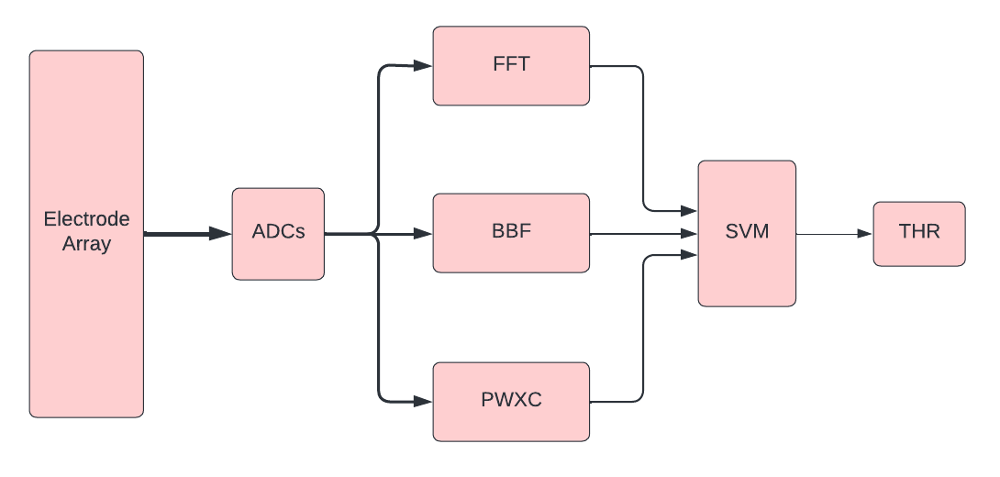

# ALOHA

### Tool Status


Last updated: 23 July 2024

## Overview

This is a simulator designed to speedup the process of designing, testing and implementing BCI pipelines. It is built primarily for the development of the HALO/SCALO chip architecture.

This tool allows for rapid prototyping of BCI pipelines, built upon a growing library of processing elements (PEs) that can be easily integrated into a pipeline. The simulator is designed to be modular, allowing for easy integration of new PEs and pipelines. There are many performance and visualization tools built into the simulator to help evaluate different design choices.

Furthermore, this tool allows for the simple integration of RTL within the high level simulation. This allows for rapid prototyping of BCI pipelines in Python/C and then a more detailed, hardware accurate simulation with Verilog.

## TODOs
- Add `pydoc`
- Enforce `mypy`
- Add automatic formatting of Python style
- Add verilog into `pytest` testing
- Finish table of contents

## Table of contents
- [Introduction](#introduction)
- [Simulator Overview](#simulator-overview)
- [Environment Setup](#environment-setup)
- ... to do

## Simulator Overview

There are currently two versions of the simulator. The [Combined Simulator](#combined-simulator) supports verilog, although soon will be obsolete as we tend to a better interface that is more scalable. It was one of the earlier iterations of the simulator.

The other directories that are present such as `pipelines` and `asa` are what are currently being developed and will be present in the future. They currently only support Python, but will soon support rtl as well.

Both simulators will require the same environment setup, which is described in the next section.

## Environment Setup

The simulator was developed in a GitHub Codespaces environment, which is a Linux based environment. The device information is shown below.

`Linux codespaces Ubuntu 20.04.6 LTS SMP x86_64 x86_64 x86_64 GNU/Linux`

Furthermore, the simulator was developed in Python 3.10.14. There are a few dependencies that need to be installed to run the simulator. The dependencies are in the [environment.yml](./environment.yml) file. You can easily create and activate an identical conda environment by running the following command. This should get you set up.

```sh
conda env create -f environment.yaml
conda activate scalo_sim
```

*note: to remove a conda environment, use `conda env remove --name your_env_name`*

## Simulator Contents

The Simulator is divided into multiple directories, each with a specific purpose. The following is a brief overview of each directory.

**[asa](./asa)**: This is the accelerator set architecture (ASA) directory. This directory contains all of the processing elements that are used in pipelines.

**[pipelines](./pipelines)**: This directory contains all of the pipelines that are used in the simulator. These pipelines are built using the processing elements in the ASA directory.

**[signals](./signals)**: This directory contains all of the management of input signals for the simulator. This could include generating signals or dealing with importing ieeg signals measured in real life.

**[datasets](./datasets)**: This directory contains all of the datasets that are used in the simulator. They also contain machine learning models trained on the data. This directory is currently not cleanly interfaced with the rest of the simulator, but still contains important standalone code.

## ASA

ASA stands for accelerator set architecture. This directory contains all of the processing elements that are used in pipelines created by the simulator. For example, let's say you wanted to create a pipeline for detecting seizures from ieeg data. One method (inspired by [Shiao et al.](https://www.ncbi.nlm.nih.gov/pmc/articles/PMC5359075/)) is to use the pipeline depicted below.

<div style="text-align: center;">
  
</div>

To create this pipeline we would have to first implement all of the individual processing elements such as the FFT, SVM, etc. In [./asa/parent](./asa/parent) you can see the parent class which every processing element inherits from. This class defines all the necessary methods and attributes a processing element must contain.

Within the directory, there are subdirectories for each processing element. For example, the FFT processing element is in [./asa/fft](./asa/fft). This directory contains all of the necessary files to implement the FFT processing element. This includes the Python implementation of the processing element, the RTL implementation, and the testing of the processing element.

### FFT processing element example 

The fft also provides a good example of how to implement a processing element. First thing to know is that everything is typed in this simulator. This is so that in the future it is easier to ensure type checking and make the simulator more robust, especially when it comes to integrating RTL. 

When creating a new processing element, after creating a new directory you should import any necessary libraries and define the class (giving it an appropriate name, such as "FFT" for the fft PE).

```python
import numpy as np
import matplotlib.pyplot as plt

from numpy.typing import NDArray
from typing import List, Tuple

import os
from asa.parent import ProcessingElement

class FFT(ProcessingElement):
    """
    Performs the Discrete Fourier Transform (DFT) using the Fast Fourier 
    Transform (FFT) algorithm.
    """
    name = "FFT"
```

Then you need to define the `__init__` method. This method should take in any necessary parameters and set the attributes of the class. It should also initialize its parent class (which in this case is the ProcessingElement class). For example, the FFT PE takes in the number of points in the FFT and the sampling frequency, as well as berger bands for the power estimation.

```python
def __init__(self, berger_bands: List[Tuple[int, int]],
                n_samples: int, 
                fs: int,
                clk: int = 0, save_vizualisation: bool = False,
                ) -> None:

    super().__init__(name = self.name,
                        clk = clk,
                        save_vizualisation = save_visualization)
    
    self.points = n_samples
    self.sample_freq = fs
    self.berger_bands = berger_bands
```

The `.run()` method is the main method of the processing element. It orchestrates the running of the processing element. It should look nearly identical for every processing element with calls made to other methods such as `.compute()`.

```python
def run(self) -> NDArray[np.float32]:
    # load input data
    input_data = self.load_inputs()
    # validate dimensions
    self.dimension_validate(input=input_data)
    # compute
    output = self.compute(input=input_data)
    # vizualise
    if self.save_visualization:
        self.visualize()
    # return data
    return output
```

Then there are the `.load_input()` and `dimension_validate()` methods. The first loads in the input data from the input processing elements and the second validates the dimensions of the input data. The validation will become increasingly important as projects become more complex, ensuring that a PE takes in the correct size matrix for example, and so preventing unecessary errors.

```python
def load_inputs(self) -> NDArray[np.float32]:
    input_PEs = self.inputs
    # concatenate input data from input PEs
    input_data = []
    for PE in input_PEs:
        input_data.append(PE.run())

    # concatenate input data
    input_data = np.concatenate(input_data, axis=0)
    return input_data

def dimension_validate(self, input: NDArray[np.float32]) -> None:
    self.input_dimension = input.shape
    self.channels = self.input_dimension[0]
    self.num_samples = self.input_dimension[1]
    assert self.num_samples == self.points, "Number of samples must match" # check for dimension correctness.
```

The `.compute()` method is where the actual computation of the processing element is done. This is where the FFT is calculated. The input and output types must be strictly defined.

```python
def compute(self, input: NDArray[np.float32]) -> NDArray[np.float32]:
        #... do computation ...

        # ensure output is the correct type
        fft_power_features = np.array(fft_power_features)
        return fft_power_features
```

Finally, the `.vizualise()` method is where the output of the processing element is visualized. This is not necessary for every processing element, but can be useful for debugging and understanding the output of the processing element. The idea behind this is to make the data as interpretable and accessible to the developer as possible.

```python
def visualize(self) -> None:
    # Ensure the directory exists
    output_dir = 'plots'
    os.makedirs(output_dir, exist_ok=True)

    freq_bins = np.fft.fftfreq(self.points, 1 / self.sample_freq)
    positive_freq_bins = freq_bins[:self.points // 2]
    nyquist_freq = self.sample_freq / 2

    #Plotting the output spectrum
    plt.figure(figsize=(12, 6))
    plt.plot(freq_bins, np.abs(self.fft_outputs[0]))
    plt.title('Output Spectrum of 1st input channel')
    plt.xlabel('Frequency')
    plt.ylabel('Magnitude')
    plt.grid()
    plt.savefig(os.path.join(output_dir, 'output_spectrum.png'))

    # other plots ...
```

### Testing a Processing Element


After creating a processing element it is necessary to test it. To run tests on a certain processing element, you can run the following command in the terminal.

```sh
cd ./path/to/pe
pytest -v -rP # The `-v` flag is for verbose output and the `-rP` flag is for showing debug statements.
```

Furthermore, once tests have been set up, they are automatically run on every push/pull request to the repository using GitHub Actions.

To create tests for the functionality of a processing element, you should create a file like `test_fft.py`. The function and file also must begin with `test_` to be recognised as a test. There are several ways of testing currently, which can all be found in the [./asa/fft/](./asa/fft) directory. If you simply want to implement a test for the processing element's compute function then you can write a script like the following.

```python
from asa import FFT
from asa.utils import  generate_signal
    
# create test function
def test_fft_v4() -> None:
    # generate an input signal
    input_signal = generate_signal(frequencies=[10, 20, 40],
                                   amplitudes=[20, 15, 10],
                                   fs=400,
                                   n_channels=2,
                                   n_samples=8000)
    
    # create the PE you want to test
    fft_pe = FFT(n_samples=8000,
                 fs=400,
                 berger_bands=[(0.1, 4), (4, 8), (8, 12), (12, 30), (30, 80), (80, 180)],
                 clk=1,
                 save_visualization=True)
    
    # run the pipeline
    output = fft_pe.compute(input=input_signal)

    print()
    print(f"assert test case not implemented yet, output shape:\n {output.shape}")
    assert 1 == 1
```

However, if you also wanted to test the visualizations then you might have to create a whole test pipeline. We have created a function in [./asa/utils.py](./asa/utils.py) that can be used to generate that pipeline. An example of how to use this function is shown below. This is slightly more work but lets you also test the visualizations being generated.

```python
from signals.parent import Window
from asa import FFT
from asa.utils import create_testing_pipeline, generate_signal
    
def test_fft_v3() -> None:
    # need to define signal properties for the input signal
    input_window = Window(fs=400, channels=2, samples=8000)
    
    # generate an input signal
    input_signal = generate_signal(frequencies=[10, 20, 40],
                                   amplitudes=[20, 15, 10],
                                   fs=400,
                                   n_channels=2,
                                   n_samples=8000)
    
    # create the PE you want to test
    fft_pe = FFT(n_samples=8000,
                 fs=400,
                 berger_bands=[(0.1, 4), (4, 8), (8, 12), (12, 30), (30, 80), (80, 180)],
                 clk=1,
                 save_vizualisation=True)

    # create testing pipeline
    testing_pipeline = create_testing_pipeline(test_pe=fft_pe,
                                               input_signal=input_signal,
                                               input_window=input_window)
    
    # run the pipeline
    output = testing_pipeline.run()

    for element in testing_pipeline.elements:
        print(f"Element: {element.name}, visualisation generated: {element.save_vizualisation}")
    print()
    print(f"assert test case not implemented yet, output shape:\n {output.shape}")
    assert 1 == 1
```

## Pipelines

*unfinished section*

Pipelines are a graph of processing elements joined together. An example of the shiao pipeline can be seen in [./pipelines/seizure/shiao/pipeline.py](./pipelines/seizure/shiao/pipeline.py). This pipeline is built using the processing elements in the ASA directory. The pipeline is built using the `Pipeline` class, which is a parent class that all pipelines inherit from. The pipeline class has a few important methods that are necessary for the pipeline to run. 

Like processing elements, pipelines must also be testable, and the test for the shiao pipeline can be found in [./pipelines/seizure/shiao/test_pipeline.py](./pipelines/seizure/shiao/test_pipeline.py).

All pipelines that are tested by pytest are also automatically tested on push/pull requests to the repository.


## Combined Simulator

This version of the simulator can be seen in [./Combined_Simulator/shiao](./Combined_Simulator/shiao). This is an example pipeline that demonstrates what the simulator does and its structure with the seizure detection pipeline for the SCALO architecture.

This tree below shows the important components of the simulator, although this tree is non-exhaustive. Each file/subdirectory here is related to a section of this document that explains what it does. This document is still a work in progress and will be updated as the simulator is developed.

```
.
└── [shiao](./Combined_Simulator/shiao)
    ├── Makefile
    ├── pipeline.py
    ├── plots
    │   ├── python_PEs
    │   ├── rtl_PEs
    │   └── signal_gen
    ├── processing_elements
    │   ├── c_PEs
    │   ├── python_PEs
    │   ├── rtl_PEs
    │   ├── rtl_toplevel
    │   └── rtl_wrappers
    ├── dev_tests
    └── signal_gen
        ├── simple_signal_gen.py
        └── ...
```

After setting up the environment (see [Environment Setup](#environment-setup)), you can run the example shiao pipeline by first going to the [shiao](./Combined_Simulator/shiao) directory and running the following command.

```sh
make
```

The makefile should include the following components. It's used by cocotb to define the simulation environment.


```makefile
TOPLEVEL_LANG = verilog
VERILOG_SOURCES = $(shell pwd)/processing_elements/rtl_toplevel/seizure_pipe.v
VERILOG_SOURCES += $(shell pwd)/processing_elements/rtl_PEs/spiral_fft_8192.v
TOPLEVEL = seizure_pipe
MODULE = pipeline
# MODULE = pipeline_trainedSVM
include $(shell cocotb-config --makefiles)/Makefile.sim
```


*unfinished section*

### SSH grace getting resources:

```sh
# getting an interactive session
srun --ntasks=1 --cpus-per-task=4 --mem=64GB --time=01:00:00 --partition=scavenge --pty bash

# figuring out host of resources
hostname

# ssh to hostname to get those resources ie r911u01n02.grace.ycrc.yale.edu
ssh [hostname]

# exit when done
exit
```